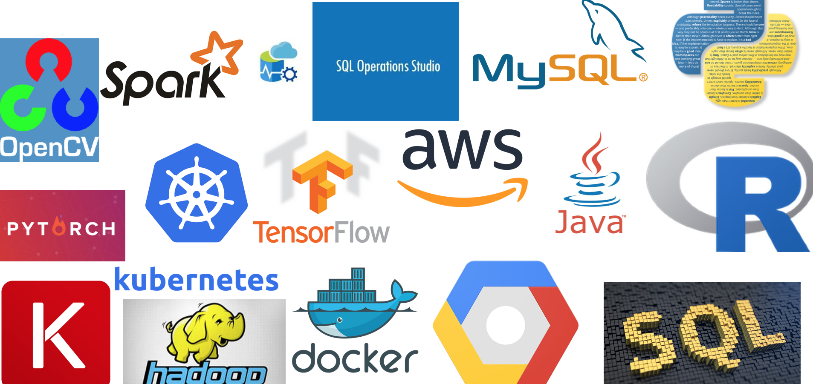

### How to get started in Data Science - Hints and Tips for Learning Machine Learning

The subject of Machine Learning covers many areas from standard deductive statistics (mean-median-mode, standard deviations, etc.) through inferential statistics (p-values, 2 sided testing, multivariate analysis, etc.). Generally the type of Machine Learning algorithm you choose will depend on the data and the type of question you are trying to answer with it. Most Machine Learning processes include data cleaning, exploratory data analysis, training, verification and retraining. Many of the tutorials for this are in the Python or R programming languages as they have pre-existing packages for running many advanced models. For distributed computing you would want to consider Spark. Additionally if you wanted to run existing API's you might consider putting your code on one of the cloud platforms such as Google GCP or Amazon AWS. Here are some links to get you started:

 
 
* Python:
  * To get started in Python: [https://www.python.org/about/gettingstarted/](https://www.python.org/about/gettingstarted/)
  * For interactive in person classes see: [https://generalassemb.ly/education/python-programming-101/sydney](https://generalassemb.ly/education/python-programming-101/sydney)
  * My Python 101 class: [https://github.com/AstroHyde/python-programming-101](https://github.com/AstroHyde/python-programming-101)
  * This article gives a how-to example of machine learning in python. [https://machinelearningmastery.com/machine-learning-in-python-step-by-step/](https://machinelearningmastery.com/machine-learning-in-python-step-by-step/)

* Statistics:
  * This 2-part article covers basic statistics for ML: [https://medium.com/technology-nineleaps/basics-of-statistics-for-machine-learning-engineers-bf2887ac716c](https://medium.com/technology-nineleaps/basics-of-statistics-for-machine-learning-engineers-bf2887ac716c)
  * Statistics in data science: [https://elitedatascience.com/learn-statistics-for-data-science](https://elitedatascience.com/learn-statistics-for-data-science)

* Machine Learning:
  * Harvard CS109 Data Science course introduces methods key aspects of data science and uses Python for all programming assignments and projects: [http://cs109.github.io/2015/](http://cs109.github.io/2015/)
  * For advanced python algorithms see: [http://scikit-learn.org/stable/](http://scikit-learn.org/stable/)
  
  ### Links for a quick Data Science startup
  
* Install Python3 on your local machine [https://www.python.org/](https://www.python.org/) with a good command line, for Mac computers I recommend using XQuartz [https://www.xquartz.org/](https://www.xquartz.org/) 
* Install a package manager, I recommend the Anaconda or Conda manager. Note that once this is installed you can have several environments for running Python2, Python3, C, or whatever else you like. [https://conda.io/docs/index.html](https://conda.io/docs/index.html)
* After Python and your package manager is installed do a conda or pip install to get the following Python packages: Matplotlib, Pandas, Seaborn, sklearn, scipy, dateutil, ascii table
* Install TopCat. This free software will come in very handy for the data exploration section: [http://www.star.bris.ac.uk/~mbt/topcat/](http://www.star.bris.ac.uk/~mbt/topcat/) 
* Create a GitHub account, we will put all our codes onto GitHub for version control and demos, you will need an account to be able to clone and fork codes: [https://github.com/](https://github.com/)
* Install Jupyter notebook, make sure that you are able to run it from the command line, this will allow us to easily share code and workshop problems together
* Optional reading. You can familiarize yourself with the basics by looking through these: [https://assets.datacamp.com/blog_assets/PandasPythonForDataScience.pdf](https://assets.datacamp.com/blog_assets/PandasPythonForDataScience.pdf) [https://www.wzchen.com/probability-cheatsheet](https://www.wzchen.com/probability-cheatsheet) 

### Links I wish I'd had earlier

* GCP Free code: [https://github.com/GoogleCloudPlatform/training-data-analyst/](https://github.com/GoogleCloudPlatform/training-data-analyst/) 
* GCP codelabs: [https://codelabs.developers.google.com/cloud](https://codelabs.developers.google.com/cloud) 
* Python Data Science Handbook: [https://github.com/jakevdp/PythonDataScienceHandbook](https://github.com/jakevdp/PythonDataScienceHandbook) 
* Data Science Handbook: [http://www.thedatasciencehandbook.com ](http://www.thedatasciencehandbook.com )
* Kaggle: [https://www.kaggle.com/](https://www.kaggle.com/)
* Data Science guide: [http://www.datasciguide.com/](http://www.datasciguide.com/) 
* Coursera: [https://www.coursera.org/](https://www.coursera.org/) 
* Khan Academy: [https://www.khanacademy.org/](https://www.khanacademy.org/) 
* To get started in Python: [https://www.python.org/about/gettingstarted/](https://www.python.org/about/gettingstarted/)
* For interactive in person classes see: [https://generalassemb.ly/education/python-programming-101/sydney](https://generalassemb.ly/education/python-programming-101/sydney)
* How-to-example of machine learning in python: [https://machinelearningmastery.com/machine-learning-in-python-step-by-step/](https://machinelearningmastery.com/machine-learning-in-python-step-by-step/)
* This 2-part article covers basic statistics for ML: [https://medium.com/technology-nineleaps/basics-of-statistics-for-machine-learning-engineers-bf2887ac716c](https://medium.com/technology-nineleaps/basics-of-statistics-for-machine-learning-engineers-bf2887ac716c)
* Statistics in data science: [https://elitedatascience.com/learn-statistics-for-data-science](https://elitedatascience.com/learn-statistics-for-data-science)
* Harvard CS109 Data Science course: [http://cs109.github.io/2015/](http://cs109.github.io/2015/)
* For advanced python algorithms see: [http://scikit-learn.org/stable/](http://scikit-learn.org/stable/)

