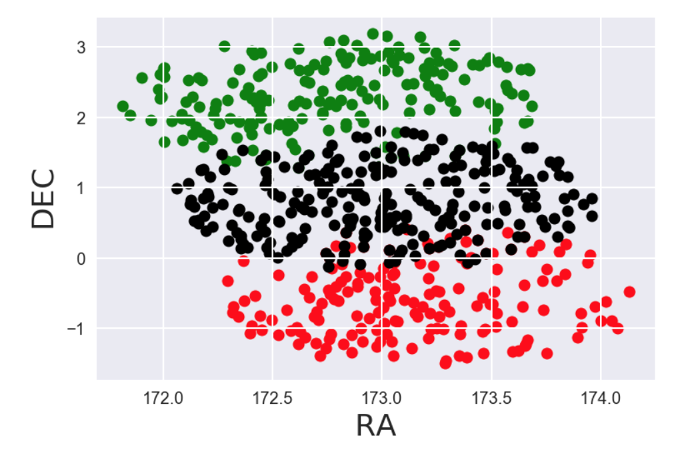

### ACAMAR Data Science and Visualisation 2018 with Dr. Elaina A. Hyde: 

----------------
#### ACAMAR Participants: 
#### Xiao Chen, Yihan Liu, Lingling Wang, Shaoguang Guo, Lang Shao, Yuchen Liu, Yingkang Zhang, Yang Tian
--------------

This interactive set of workshops and lectures was run from 5 - 7 Aug, 2018 at the Shanghai Astronomical Observatory, for the 1st ACAMAR Astroinformatics School, Shanghai, China. The session I taught focused on Data Science and allowed students can choose their own data or use existing spectroscopic data to walk through the analytical research process and machine learning. We covered the EDA (exploratory data analysis) on reduced spectroscopic data and how we can prepare and perform for machine learning in astronomical data, and significantly ‘what is machine learning and when should we use it’. Students will learn basic Machine Learning concepts and how to apply them correctly with a Statistical approach as well as some discussion of advanced techniques and visualisation. Students presented their findings on the last day. The students for my 2018 session were very motivated and enthusiastic, they voted and chose to name themselves the Coding Pandas!

 

### The Basic Preparation for Data Science

The students for this session all had some required prework, I recommend the following for anyone interested in starting up with Data Science:
1. Install Python3 on your local machine https://www.python.org/  with a good command line, for Mac computers I recommend using XQuartz https://www.xquartz.org/ 
2. Install a package manager, I recommend the Anaconda or Conda manager. Note that once this is installed you can have several environments for running Python2, Python3, C, or whatever else you like. https://conda.io/docs/index.html 
+ After Python and your package manager is installed do a conda or pip install to get the following Python packages:
+ Matplotlib, Pandas, Seaborn, sklearn, scipy, dateutil,asci table
3. Install TopCat. This free software will come in very handy for the data exploration section: http://www.star.bris.ac.uk/~mbt/topcat/ 
4. Create a GitHub account, we will put all our codes onto GitHub for version control and demos, you will need an account to be able to clone and fork codes: [https://github.com/](https://github.com/)
5. Install Jupyter notebook, make sure that you are able to run it from the command line, this will allow us to easily share code and workshop problems together: 
6. Think about what data you might like to use, you will need to have it converted and reduced to rows and columns in asci or csv beforehand or you will be using the GALAH dataset which I will give to the class. If you want to read about GALAH see the website here: https://galah-survey.org/ 
7. Optional reading. You can familiarize yourself with the basics by looking through these in advance:
https://assets.datacamp.com/blog_assets/PandasPythonForDataScience.pdf
https://www.wzchen.com/probability-cheatsheet

### Three Days, Data Science, Stats, and a Mystery Dataset

This interactive workshop started with an introduction to Git, Github, statistics and the in particular the descriptive statistics needed for for Exploratory Data Analysis (EDA). As one of the goals in ACAMAR is to have the students present, our group covered presenting techniques and the Pecha Kucha format as well as some general tips about putting together visuals. With this foundation we were then able to move into Data Science with pythonic implementations of descriptive statistics and interactive exploration using the TopCat software.

 

On our second day we had to cover (albeit very lightly) all of Data Science methodology and some important machine learning as well as decide on a research project for our group. The Coding Pandas bravely decided to jointly analyse a mysterious dataset that was taken with the Anglo-Australian Telescope at the Siding Spring Observatory in Australia.

We outlined popular machine learning algorithms such as regression, clustering, classification and focused on how they could be properly used under the umbrella of Data Science. Each participant analysed the data and focused on part of the problem. On Day 3 we finished with a few extra tips and tricks and were able to see that the field of stars chosen had different populations. Here are a few of the results produced by the students:

* The stars in the field have different velocities
* TopCat can be VERY useful for exploration, matching data, and exploring in 3D
* Visualization is important
* We can create a descriptive statistical analysis using histograms and bar-chart of the stars in the population
* Python Pandas is very useful when describing our data
* K-Nearest Neighbors Classification machine learning algorithms show a difference in the population of our stars
* Evaluating our Classification algorithm shows that we should use less than 10 K-Nearest Neighbors

### What's next?

With the skills from Descriptive and Inferential Statistics, Good Data Science is possible. With Good Data Science, we can persue Machine Learning algorithms and approaches to generalising patterns in our data and discovering differences in the populations of our data. With all of that we can approach interesting research problems. In this case, we have now shown that the area of stars in the region does have different populations. What those populations are, what it means for astronomy, our Galaxy and for the evolution of all galaxies is yet to be determined. Stay tuned ;-)

<!-- Next you can update your site name, avatar and other options using the _config.yml file in the root of your repository (shown below). -->

<!--

The easiest way to make your first post is to edit this one. Go into /_posts/ and update the Hello World markdown file. For more instructions head over to the [Jekyll Now repository](https://github.com/barryclark/jekyll-now) on GitHub.
-->
